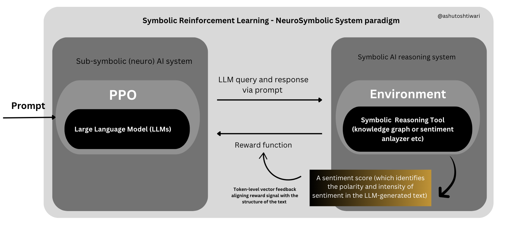
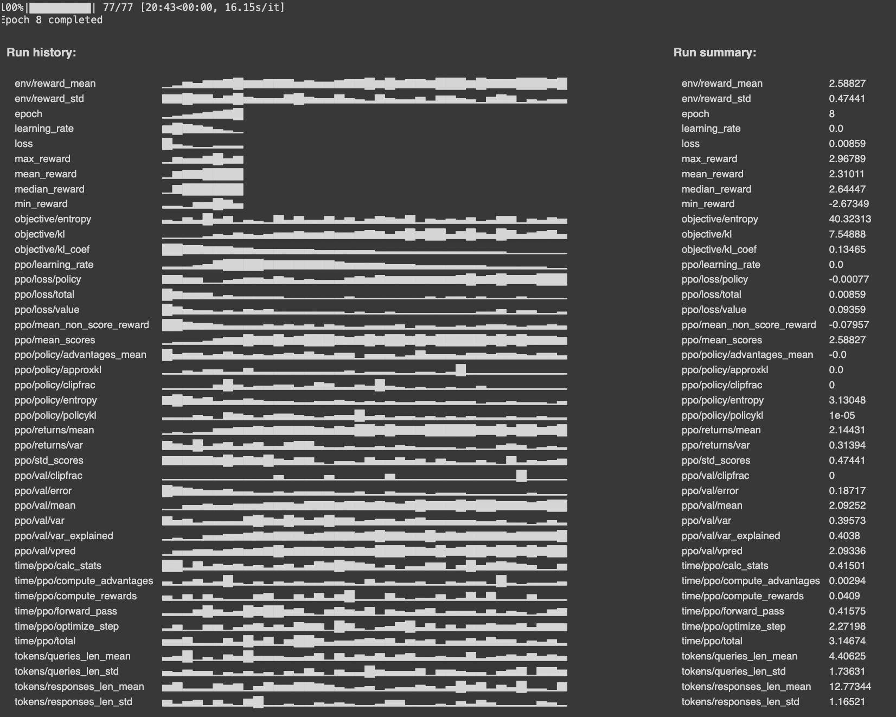
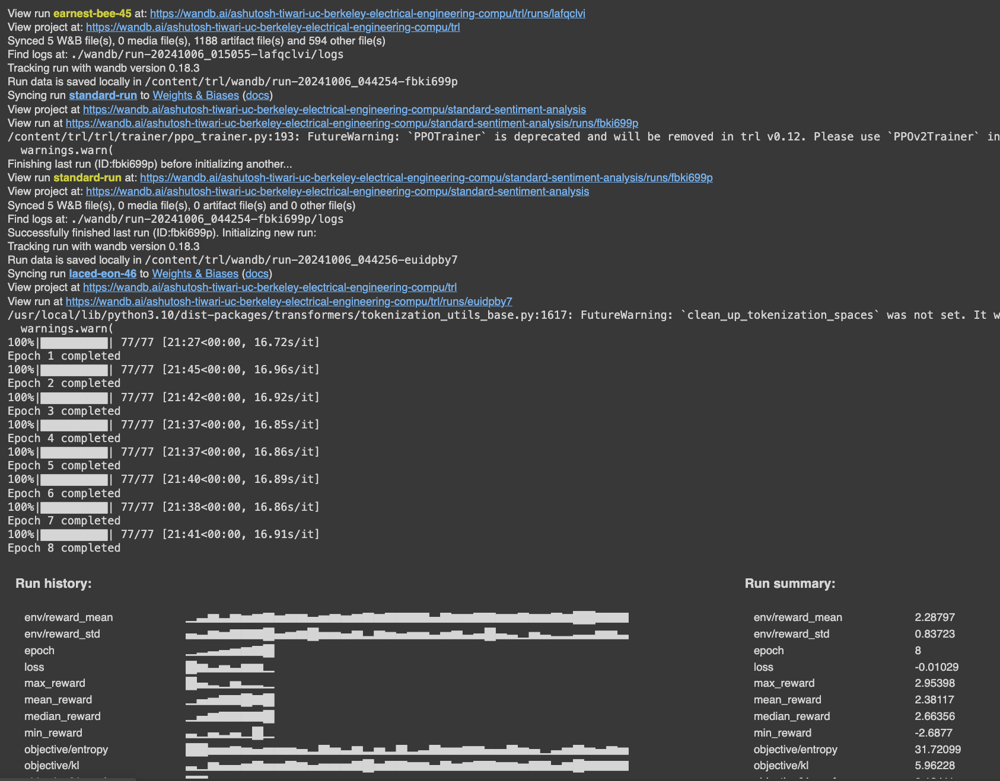
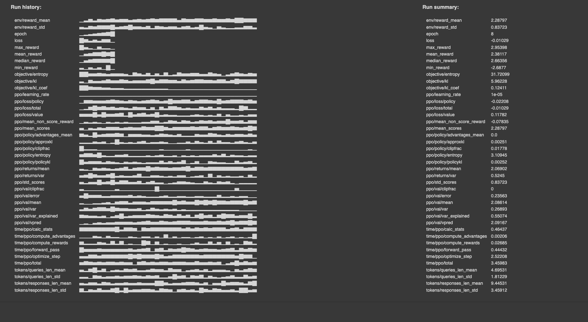

# Reinforcment leanring via symbolic feedback 

Project Writeup on my Substack blog [Here](https://ashutoshkumartiwari.substack.com/p/adding-token-level-symbolic-vector)

#### (This project is a Work in Progress, and needs code optimization & tests for various usecases and benchmarks)

## Research Question
How can we enhance the reasoning capabilities of Large Language Models (LLMs) by integrating them with symbolic reasoning systems and incorporating corrective feedback loops? 

## Problem 
Recent AI advancements has proved that the logical reasoning capabilties of contemporary LLMs are, at best *fragmentary*. (may work well on some problem instances but fail dramatically on others). While traditional LLMs fine-tuning approaches (via human feedback) do address this problem to some degree, they suffer from many issues like --- 
- "Black-box" reward models  
- Difficulties in collecting preference data (from replay buffer/memory)
- Sparse scalar values

These limitations creates a need for methods that can combine the strengths of LLMs with those of symbolic reasoning systems (Knowledge graphs, contraint solvers etc.) to create more robust and capable AI systems. The challenge is the integration of these two approaches to leverage their respective strengths while addressing the limitations of current fine-tuning methods like RLHF which are at best expensive, error-prone, and may not fully capture the nuances of reasoning tasks.

More project detials [here](https://ashutoshkumartiwari.substack.com/p/adding-token-level-symbolic-vector)

## Implementation Memo
This project aims to implement a new fine-tuning method which uses the prowess of "Symbolic AI" systems to enhance the reasoning capabilties in tradiitonal LLM models for a specific usecase of detecting positive sentiments in the IMDB dataset for movie reviews.

- RL agent : LLM that needs fine-tuning
- Environment (is the symbolic component): Has the reasoning capabilties of to reasoning, domain knowledge, knwoledge graph tools
- A unqiue *token-level* reward signal (vector "feedback").

More on reward signal and the ultimate goal : 
This system implements a fined-graine *token-level* reward model (which is unique to the one currently with scalar "feedback")as-
- Takes a prompt and a response.
- Combines them into a full text.
- Tokenizes the full text.
- Gets the sentiment score for the full text.                        
- Creates a feedback list where each token gets the same feedback value:
   - If the sentiment score is > 0.5 (positive), it uses the score as is.
   - If the sentiment score is <= 0.5 (negative), it uses (1 - score).

This approach encourages the model to generate responses that result in strong sentiments (either positive or negative) when combined with the input prompt. The vectorized nature of the rewards (one value per token) allows the reinforcement learning algorithm to potentially learn which parts of the text contribute more to the sentiment.

## More on architecture - 



<!-- <p align="center">
  
</p> -->


In the forward direction (LLM to environment), text responses generated by the LLM are fed to the RLSF environment, which leverages a pre-trained sentiment analysis model to perform analysis of such text against sentiment specifications or domain knowledge. This sentiment analyzer acts as our reasoning tool, evaluating the sentiment of the generated text.

In the reverse direction (environment to LLM), a sentiment score (which identifies the polarity and intensity of sentiment in the LLM-generated text) produced by the sentiment analysis tool is used as part of a reward function to provide corrective feedback to the LLM. Leveraging the sentiment analyzer to generate these scores, which provide fine-grained (token-level) feedback to LLMs, eliminates the need for manual sentiment labeling and addresses limitations of traditional reward models in sentiment analysis tasks.

While the current implementation doesn't fully exploit the potential of token-level feedback (since we use the same value for each token), it still provides a *good* signal than a single scalar value. This approach bridges the gap between simple scalar feedback and more sophisticated token-by-token sentiment analysis.


## Installation and Running

### Installation

Note: The code uses modified parts of the [Huggingface TRL library](https://github.com/huggingface/trl), adding support for vector feedbacks.

1. Clone the repository:
   ```
   git clone https://github.com/ashutoshtiwari13/RL-Symbolic-Feedback.git
   cd rlsf-sentiment-analysis
   ```

2. Create a virtual environment and activate it:
   ```
   python -m venv venv
   source venv/bin/activate
   ```

3. Install the project in editable mode:
   ```
   pip install -e .
   ```

4. Set up your Weights & Biases account and login:
   ```
   wandb login
   ```


### Running the Training Script

To start the training process, you can use the following command:

```
python scripts/train.py --epochs 15 --accumulation_steps 4 --eval_samples 2000
```

Command-line arguments:
- `--epochs`: Number of training epochs (default: 10)
- `--accumulation_steps`: Number of gradient accumulation steps (default: 4)
- `--eval_samples`: Number of samples to use for evaluation (default: 1000)


Initially training done on [](https://github.com/ashutoshtiwari13/RL-Symbolic-Feedback/blob/main/src/scratch-work/final_rlsf_implementation.ipynb)


## Intial Results

<p align="center">
  
  
  
</p>

## Project Structure

```
rlsf-sentiment-analysis/
│
├── src/
│   ├── __init__.py
│   ├── config.py                 # Configuration settings
│   ├── data/
│   │   ├── __init__.py
│   │   └── dataset.py            # Dataset loading and preprocessing
│   ├── models/
│   │   ├── __init__.py
│   │   └── model.py              # Model definitions and operations
│   ├── training/
│   │   ├── __init__.py
│   │   ├── rlsf_trainer.py       # RLSF training logic
│   │   ├── standard_trainer.py   # Standard training logic
│   │   └── utils.py              # Utility functions for training
│   └── environment/
│       ├── __init__.py
│       └── symbolic_environment.py  # Symbolic environment for feedback
│
├── scripts/
│   └── train.py                  # Main training script
│
├── requirements.txt              # Project dependencies
├── setup.py                      # Project setup file
├── README.md                     # This file
└── .gitignore                    # Git ignore file
```

Key components:
- `src/config.py`: Contains configuration settings for the project.
- `src/data/dataset.py`: Handles dataset loading and preprocessing.
- `src/models/model.py`: Defines model architectures and related operations.
- `src/training/`: Contains separate modules for RLSF and standard training approaches.
- `src/environment/symbolic_environment.py`: Implements the symbolic environment for feedback.
- `scripts/train.py`: The main script for running the training process.

## Other Important Information

- **Data**: This project uses the IMDB dataset for sentiment analysis. The dataset is automatically downloaded when you run the training script.

- **Models**: We use pre-trained language models from the Hugging Face Transformers library. The specific model used can be configured in `src/config.py`.

- **Logging**: The project uses Weights & Biases for experiment tracking. Make sure you have set up your W&B account and logged in before running the training script.

- **GPU Usage**: The script automatically detects and uses a GPU if available. If you're using a specific GPU, you may need to set the `CUDA_VISIBLE_DEVICES` environment variable.

- **Checkpoints**: Model checkpoints are saved during training. You can find them in the `rlsf_checkpoints/` and `standard_checkpoints/` directories.

- **Evaluation**: The script evaluates both the RLSF and standard models after training and prints the results. Detailed logs can be found in your W&B dashboard.

For more detailed information about each component, please refer to the docstrings and comments in the respective Python files.